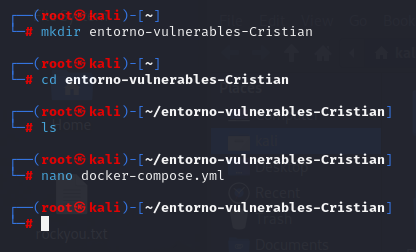
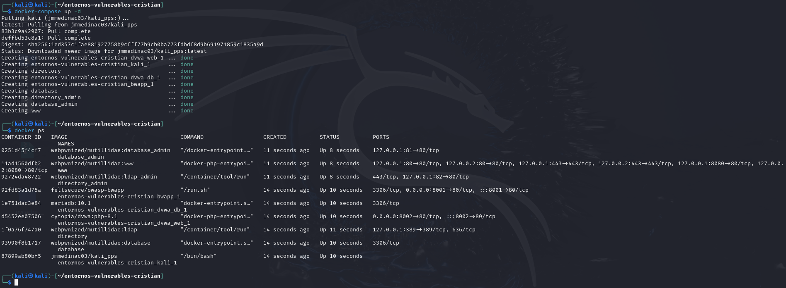
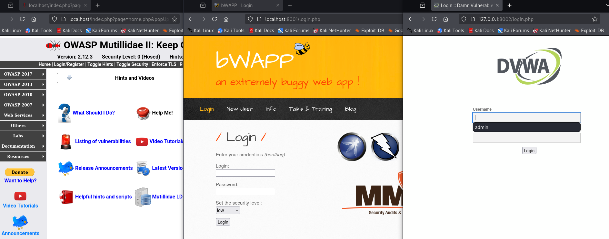
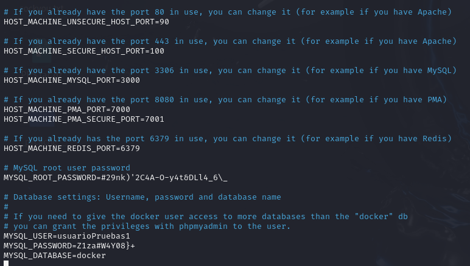
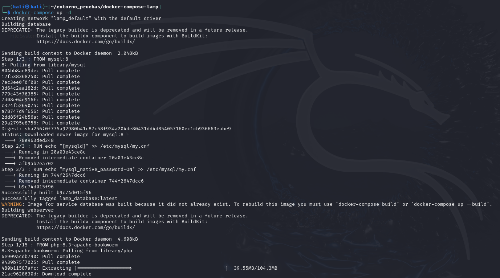
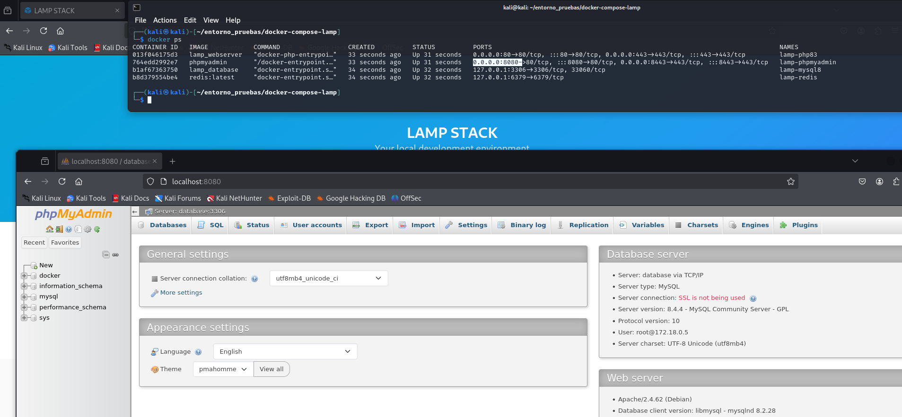

# PPS-Unidad3Actividad1-Cristian

## Índice

- [PPS-Unidad3Actividad1-Cristian](#pps-unidad3actividad1-cristian)
  - [Índice](#índice)
  - [Creación de entorno de maquinas vulnerables](#creación-de-entorno-de-maquinas-vulnerables)
    - [¿Cómo preparamos nuestro entorno?](#cómo-preparamos-nuestro-entorno)
  - [Imagen 3: Máquinas vulnerables en funcionamiento](#imagen-3-máquinas-vulnerables-en-funcionamiento)
  - [Creación de entorno de pruebas](#creación-de-entorno-de-pruebas)
    - [Repositorio Base](#repositorio-base)
    - [Pasos para Configurar el Entorno](#pasos-para-configurar-el-entorno)
    - [Verificación del Archivo docker-compose.yml](#verificación-del-archivo-docker-composeyml)
    - [Levantar el Entorno](#levantar-el-entorno)


## Creación de entorno de maquinas vulnerables

En este punto vamos a crear mediante un docker-compose 3 entornos vulnerables:

- **Damn Vulnerable Web Application (DVWA)**
- **Buggy Web Application (bWAPP)**
- **OWASP Mutillidae II**

### ¿Cómo preparamos nuestro entorno?

Para comenzar a trabajar con estas aplicaciones vulnerables, solo necesitamos seguir estos pasos:

1. Creamos una carpeta con el nombre `entorno-vulnerables-tunombre`.
2. Colocamos dentro de ella el archivo `docker-compose.yml` que se encuentra en la carpeta `entornoMaquinasInseguras` de este repositorio.

<p align="center">
  
</p>
<p align="center"><em>Imagen 1: Creación de carpetas y docker compose</em></p>

El código del `docker-compose.yml` será:
```yml
version: '2.4'

services:

  dvwa_web:
    # Usuario: admin | Contraseña: password
    image: cytopia/dvwa:php-${PHP_VERSION:-8.1}
    ports:
      - "${LISTEN_PORT:-8001}:80"
    networks:
      - labpps-net
    environment:
      - RECAPTCHA_PRIV_KEY=${RECAPTCHA_PRIV_KEY:-}
      - RECAPTCHA_PUB_KEY=${RECAPTCHA_PUB_KEY:-}
      - SECURITY_LEVEL=${SECURITY_LEVEL:-low}
      - PHPIDS_ENABLED=${PHPIDS_ENABLED:-0}
      - PHPIDS_VERBOSE=${PHPIDS_VERBOSE:-0}
      - PHP_DISPLAY_ERRORS=${PHP_DISPLAY_ERRORS:-1}
      - MYSQL_HOSTNAME=dvwa_db
      - MYSQL_DATABASE=dvwa
      - MYSQL_USERNAME=dvwa
      - MYSQL_PASSWORD=p@ssw0rd

  dvwa_db:
    image: mariadb:10.1
    hostname: dvwa_db
    volumes:
      - dvwa_db_data:/var/lib/mysql
    environment:
      - MYSQL_ROOT_PASSWORD=rootpass
      - MYSQL_DATABASE=dvwa
      - MYSQL_USER=dvwa
      - MYSQL_PASSWORD=p@ssw0rd
    networks:
      - labpps-net

  bwapp:
    image: feltsecure/owasp-bwapp
    ports:
      - "${LISTEN_PORT:-8002}:80"
    networks:
      - labpps-net

  kali:
    image: kalilinux/kali-rolling  # Imagen más ligera
    hostname: kali
    cap_add:
      - NET_ADMIN
    stdin_open: true
    tty: true
    volumes:
      - ./kali-volume:/root/kali
    networks:
      - labpps-net

  # Máquinas de Mutillidae
  database:
    container_name: database
    image: docker.io/webpwnized/mutillidae:database
    networks:
      - datanet

  database_admin:
    container_name: database_admin
    depends_on:
      - database
    image: docker.io/webpwnized/mutillidae:database_admin
    ports:
      - "127.0.0.1:81:80"
    networks:
      - datanet

  www:
    container_name: www
    depends_on:
      - database
      - directory
    image: docker.io/webpwnized/mutillidae:www
    ports:
      - "127.0.0.1:80:80"
      - "127.0.0.1:8080:80"
      - "127.0.0.1:443:443"
      - "127.0.0.2:80:80"
      - "127.0.0.2:8080:80"
      - "127.0.0.2:443:443"
    networks:
      - datanet
      - labpps-net

  directory:
    container_name: directory
    image: docker.io/webpwnized/mutillidae:ldap
    volumes:
      - ldap_data:/var/lib/ldap
      - ldap_config:/etc/ldap/slapd.d
    ports:
      - "127.0.0.1:389:389"
    networks:
      - labpps-net

  directory_admin:
    container_name: directory_admin
    depends_on:
      - directory
    image: docker.io/webpwnized/mutillidae:ldap_admin
    ports:
      - "127.0.0.1:82:80"
    networks:
      - labpps-net

# Creación de redes para la comunicación entre contenedores
networks:
  labpps-net:
    driver: bridge
  datanet:

# Volúmenes para persistencia de datos
volumes:
  dvwa_db_data:
  ldap_data:
  ldap_config:
```

3. Levantamos el escenario multicontenedor con el siguiente comando:

   ```bash
   docker-compose up -d
   ```

<p align="center">
  
</p>
<p align="center"><em>Imagen 2: Levantar entornos vulnerables</em></p>

<p align="center">
  
</p>
<p align="center"><em>Imagen 3: Máquinas vulnerables en funcionamiento</em></p>
---

## Creación de entorno de pruebas

Podemos optar por varias soluciones:

- Crear una máquina virtual con la pila necesaria (LAMP, LEMP, MEAN, XAMPP, etc.).

- Utilizar Docker para construir un entorno multicontenedor con una de estas pilas.

En esta ocasión, optamos por la segunda opción: un escenario multicontenedor con Docker, basado en una pila LAMP (Linux, Apache, MySQL, PHP).

### Repositorio Base

Usaremos el siguiente repositorio como base:

https://github.com/sprintcube/docker-compose-lamp

Este repositorio ya contiene una configuración funcional para levantar un entorno LAMP con PHPMyAdmin y Redis.

### Pasos para Configurar el Entorno

1. **Clonar el repositorio:**

```bash
git clone https://github.com/sprintcube/docker-compose-lamp.git
cd docker-compose-lamp/
```

2. **Copiar el archivo de variables de entorno:**

```bash
cp sample.env .env
```

3. **Modificar ``.env`` según nuestras necesidades.**

Este archivo define:

- Versión de PHP y de la base de datos.
- Directorios de configuración, logs y certificados.
- Límites de carga y memoria para PHPMyAdmin.
- Puertos expuestos en la máquina local.
- Credenciales para la base de datos.

Ejemplo de parámetros a personalizar:

<p align="center">
  
</p>
<p align="center"><em>Imagen 4: Mejorar la configuración de seguridad de contraseñas y puertos</em></p>

Importante: Para evitar vulnerabilidades comunes según OWASP (como configuraciones por defecto inseguras), es recomendable cambiar:

- Puertos por defecto (80, 443, 3306, etc.).

- Contraseñas por defecto.

- Nombres de usuarios y bases de datos.

### Verificación del Archivo docker-compose.yml

Antes de levantar el entorno, revisamos el archivo ``docker-compose.yml``. Este define los servicios del entorno:

Los servicios definidos son:

- ``webserver``: Apache con PHP (versión definida en .env).

- ``database``: MySQL (o MariaDB, según configuración).

- ``phpmyadmin``: Interfaz web para administrar la base de datos.

- ``redis``: Sistema de almacenamiento clave-valor (usado habitualmente como caché).

### Levantar el Entorno

Una vez configurado el entorno y revisados los servicios, ejecutamos:

```bash
docker-compose up -d
```

<p align="center">
  
</p>
<p align="center"><em>Imagen 5: Levantar entorno de pruebas lamp</em></p>

Este comando descarga las imágenes necesarias y crea los contenedores definidos. Si todo funciona correctamente, podremos acceder a:

- Nuestra aplicación en: ``http://localhost:80`` y ``http://localhost:443``
- PHPMyAdmin en: ``http://localhost:8080``

<p align="center">
  
</p>
<p align="center"><em>Imagen 6: Entorno de pruebas lamp levantado</em></p>

Con el entorno levantado, podremos:

- Introducir vulnerabilidades en el código de la aplicación.

- Observar comportamientos inseguros (como configuraciones por defecto).

- Aplicar buenas prácticas y realizar correcciones.

